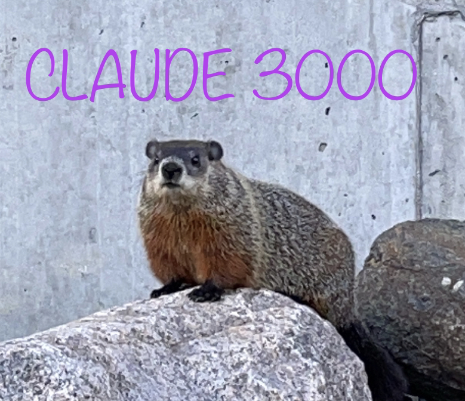

#  ClaudNected

[Wonder Jam 2021, UQAC](https://itch.io/jam/-wonderjam-uqac-2021-propuls-par-ubisoft-saguenay/entries)

Création d'un jeu en 72h sur le thème de **"La Connexion"** et 3 styles imposés :
* Gestion
* Chance
* Progression

[Page itch.io du jeu](https://itch.io/jam/-wonderjam-uqac-2021-propuls-par-ubisoft-saguenay/rate/1231056)

[Lien direct](https://theogimenez.itch.io/claudnection)

> *Notes: quelques corrections de bugs et améliorations ont été faites après la WonderJam.*

## Description :

C'est un jeu de gestion de networks où l'on doit relier des maisons demandant internet à un des datacenters disponible de façon aléatoire.
On peut relier des câbles ensembles pour faire des routeurs et ainsi des nœuds.
Ces routeurs, dotés d'une IA, vont rediriger chaque paquet sur le bon cable en fonction des différents chemins possibles, de leur capacité restante et de leur distance.

Le joueur doit gérer son argent et acheter des datacenters en fonctions de la demande et réussir à faire un beau câble management pour trier les câbles afin que chaque maison soit reliée à tous les datacenters.

La partie est terminée quand le taux de statisfaction des habitants est trop bas (trop de pertes de paquets dû à un cable plein ou un datacenter ayant une file d'attente pleine).

## Made by : Team Claude 3000 !  
* [GIMENEZ Théo](https://github.com/TheoGimenez7)
* [TABARAUD Antoine](https://github.com/AntTBD)
* [PAYET Guillaume](https://github.com/Azonic-dev)
* [CHEVALLEREAU Aurélien](https://github.com/TheOrtech)
* [DEBEAULIEU Nicolas](https://github.com/NicolArrayList)
* [VEDRENNE Nicolas](https://github.com/nicolasvedrenne)

*Octobre 2021, UQAC, CA*

## Download

Le jeu est disponible au téléchargement dans les [releases](../../releases/latest) en version :
* Windows x86_64
* Android (apk)

Une version WebGL est également disponible [ici](https://anttbd.github.io/ClaudNected/WebGL/).

> Made with *Unity Version 2020.3.20f1*

## Made your own strategic !
| Home |
| ---- |
|  |

| First demo |
| ---------- |
|  |

## Upgrades
* Houses satisfaction
* Cables full statut (red)
* Cable capacity upgradable
* Final screenshot
* Display more information
* Spawn circle

| Exemple 1 |
| --------- |
|  |

| Exemple 2 |
| --------- |
|  |

| Exemple 3 |
| --------- |
|  |

| Exemple 4 |
| --------- |
|  |

| End |
| --- |
|  |
